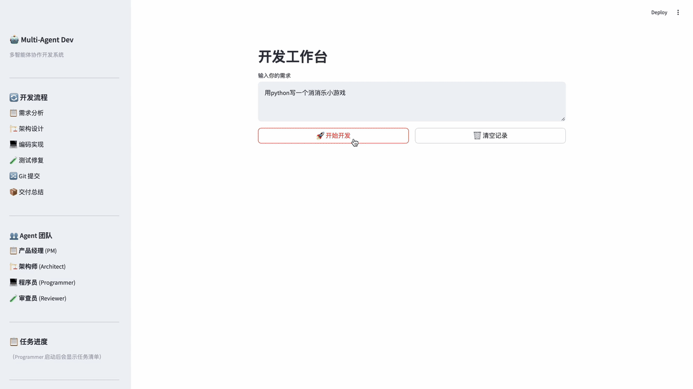
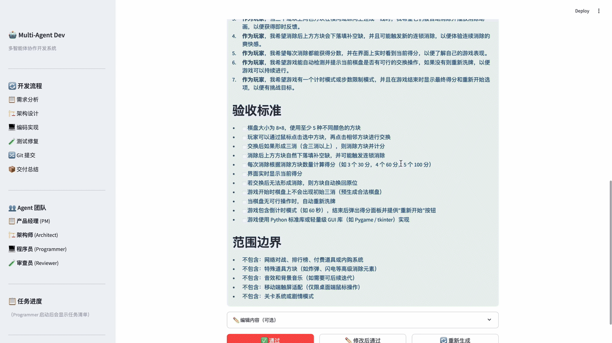
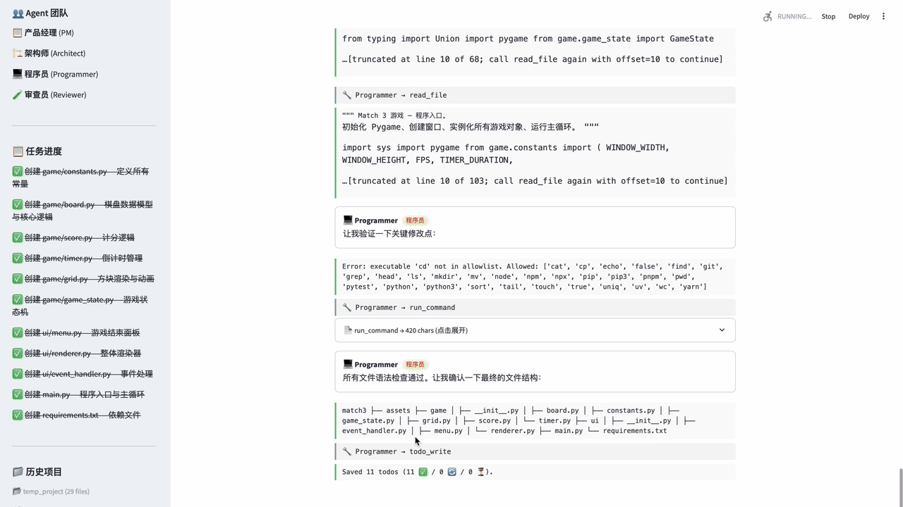
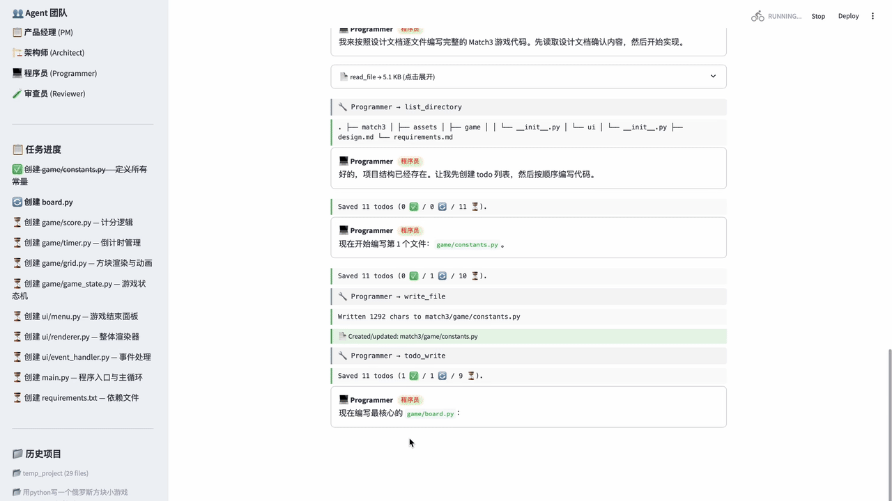
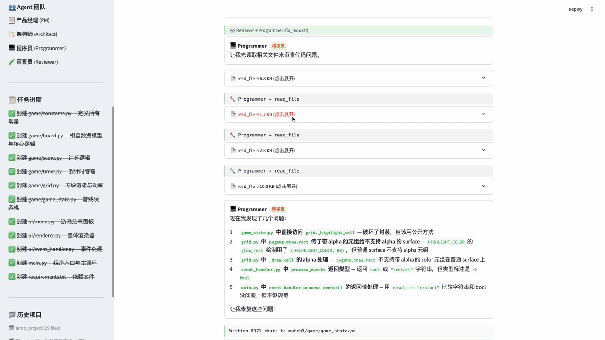

# Multi-Agent Collaborative Development System

多智能体协作开发系统 — 从自然语言需求到可运行项目的全自动开发流水线。

4 个 AI Agent（产品经理 / 架构师 / 程序员 / 审查员）通过 **MessageBus 动态路由**协作，**Git worktree 隔离**试探性修改，**Per-workspace venv** 不污染主环境，一句话需求自动生成完整可运行的项目。

<!-- TODO: 录制顶部 demo GIF — 一句话需求到项目生成的完整过程（10-15 秒） -->
<p align="center">
  
</p>

---

## ✨ Features

### 🛰️ MessageBus 动态路由

每个 Agent 通过收件箱通信，**没有硬编码状态机**。Reviewer 发现需求矛盾时可以直接 `escalation → PM`，绕过修复循环重新厘清需求——这种非线性边以前在 7 阶段流水线里写不出来。所有消息进 `bus.audit` 形成完整执行 trace。

<!-- TODO: GIF — 展示 audit log 里的非线性边 (Reviewer → PM 升级) -->
<p align="center">
  
</p>

### 🌿 Git Worktree 隔离 Fix-Loop

Reviewer 发现 bug 触发 fix → 立刻 `git worktree add -b fix/attempt-N`，Programmer 的修复全部在隔离分支里改。验证通过 → `git merge --squash` 回 main；失败/升级 → `git worktree remove` 丢弃，**main 永远只看到通过的修改**。

<!-- TODO: GIF — fix-loop 中 worktree 的创建、commit、merge/discard -->
<p align="center">
  
</p>

### 📋 实时进度面板（对应 docs/s03 TodoWrite）

Programmer 用 `todo_write` 工具维护任务清单，sidebar 用 `✅🔄⏳` 实时反映状态。长任务的"不知道还要多久"焦虑消失。

<!-- TODO: GIF — 写多个文件时 sidebar todos 状态变化 -->
<p align="center">
  
</p>

### ✏️ Editable Approval Gates

审批门下方的 expander 直接编辑 `requirements.md` / `design.md`，点 **修改后通过** —— 编辑后的内容同步写回 workspace 文件，下游 Agent 看到的是审批后版本。

<!-- TODO: GIF — 打开 expander 改内容，点击修改后通过 -->
<p align="center">
  
</p>

### 🐍 Per-Workspace Venv 隔离

每个 workspace 启动时自动 `python -m venv .venv`，`run_command` 注入 PATH 让所有 `pip` / `pytest` / `python` 调用走 venv。**对 Agent 完全透明**——agent prompt 里写 `pip install -r requirements.txt` 不需要任何改动，但你的主 Python 环境永远干净。

```
workspace/<project>/
├── .venv/             ← 每个项目独立的 Python 环境
├── .git/              ← Programmer 的代码 + fix squash 历史
├── .todos.json        ← Programmer 的进度
├── requirements.md
├── design.md
└── src/
```

### 🌊 单次 Streaming + Tool Result Expander

`ToolAgent.run_with_tools` 是**单次 `stream=True` LLM 调用**，从 chunk delta 累积 `tool_calls`，token 成本减半且 streaming 一致。Tool 结果默认 200 字预览 + 点击展开看完整内容——`read_file` 一个 2KB 的文件不会霸占整个屏幕。

<!-- TODO: GIF — streaming 文本 + tool call 展开 -->
<p align="center">
  
</p>

### 📄 Smart `read_file` 分页

LLM 默认读 2000 行；超大文件返回 `…[truncated at line X of Y; call read_file again with offset=X to continue]` 续读提示，Agent 自己 paginate。三层防御：行数 / 行数硬顶 10000 / 200KB 字节兜底。**单次 tool 结果永远不会爆 token**。

### 🔒 安全沙箱

- 命令**白名单**（python/pip/pytest/node/npm/git/ls/...）+ 硬 deny 正则（rm -rf /、sudo、fork bomb 等）
- 路径穿越防护（`_resolve_path` 用 `realpath` 校验，包括 symlink escape）
- workspace 隔离 + cwd-bound subprocess
- 命令超时 30 秒（硬顶 120 秒）

### 🧪 126 个单元测试

```bash
cd multi-agent-dev
pytest tests/   # 126 passed, 0.3s
```

覆盖路径穿越（6 种 escape 都拒绝）、命令白名单（22 个 cases）、Reviewer pass/fail 解析、`yield from` 分片合并、MessageBus 优先级、read_file 分页边界等。

---

## 🤝 4 个 Agent

| Agent | 角色 | 可用工具 | 产出 |
|:---:|:---:|---------|------|
| PM | 产品经理 | read_file, write_file, list_directory | `requirements.md`（用户故事 + 验收标准） |
| Architect | 架构师 | read_file, write_file, list_directory, run_command | `design.md`（技术方案 + 文件结构 + Mermaid 架构图） |
| Programmer | 程序员 | 全部文件/git/terminal 工具 + **todo_write** | 完整源代码 + Git 提交 |
| Reviewer | 审查员 | read_file, list_directory, search_files, run_command | 测试报告（结构化 `<<<RESULT: pass/fail>>>` + 可选 `<<<ESCALATE: PM>>>`） |

每个 Agent 实现 `handle(inbox)` 自主决定下一站。**加新 Agent 不用改 engine**。

---

## 🏗️ Architecture

```
┌──────────────────────────────────────────────────────────────┐
│                  Streamlit UI (app.py)                       │
│  消息瀑布 / 审批门 (✅ ✏️ 🔄) / 📋 任务进度 / 工具结果展开          │
└────────────────────────┬─────────────────────────────────────┘
                         │ yields DevMessage (generator + send)
┌────────────────────────▼─────────────────────────────────────┐
│              DevEngine (core/engine.py)                      │
│  Bus Router 循环 / 审批门 / Worktree 生命周期 / 编辑透传         │
└────────┬───────────────────────────────────────┬─────────────┘
         │ TeamMessage 收发                       │ git mgmt
┌────────▼─────────────┐                  ┌──────▼─────────────┐
│   MessageBus         │                  │ WorktreeSession    │
│  per-recipient inbox │                  │  fix/attempt-N     │
│  + 全量 audit log     │                  │  squash-merge      │
└────────┬─────────────┘                  └────────────────────┘
         │ drain(name) → 派发
┌────────▼─────────────────────────────────────────────────────┐
│                  Agent Layer (agents/)                       │
│   PM   │  Architect  │  Programmer  │  Reviewer              │
│   handle(inbox) → run_with_tools (单次 streaming + tool 累积) │
└────────────────────────┬─────────────────────────────────────┘
                         │ execute_tool()
┌────────────────────────▼─────────────────────────────────────┐
│            MCP Server Layer (mcp_servers/)                   │
│   filesystem │ terminal │ git │ todo                         │
│   路径穿越防护 / 命令白名单 / .venv PATH 注入                    │
└────────────────────────┬─────────────────────────────────────┘
                         │ subprocess / OS ops (cwd=workspace)
┌────────────────────────▼─────────────────────────────────────┐
│              workspace/<project_name>/                       │
│   .venv/  .git/  .todos.json  requirements.md  design.md     │
│   src/ tests/ requirements.txt                               │
└──────────────────────────────────────────────────────────────┘
```

<!-- TODO: 可选 — 一张 PNG 架构图替换上面的 ASCII，更适合展示 -->

---

## 🔧 MCP Tools

| Server | 工具 | 说明 |
|--------|------|------|
| **filesystem** | `read_file` | **行级分页**（默认 2000 行 / 硬顶 10000 / 200KB 字节兜底，超长自动给续读 offset 提示） |
| filesystem | `write_file` | 创建/覆写文件，自动创建父目录 |
| filesystem | `list_directory` | 目录树（隐藏 `.venv` / `.git`） |
| filesystem | `search_files` | glob 搜索 |
| **terminal** | `run_command` | 白名单 shell 执行，**自动用 `.venv` Python**，30 秒超时硬顶 120 秒 |
| **git** | `git_init/add/commit/status/diff` | git 子命令 |
| **todo** | `todo_write` | 整批替换语义的任务清单（驱动 sidebar 进度面板） |

按角色 **最小权限**：PM 不能 `run_command`，Reviewer 不能 `write_file`，只有 Programmer 能 `todo_write`。

---

## 🚀 Quick Start

### 1. 安装依赖

```bash
pip install -r requirements.txt
```

### 2. 配置环境变量

```bash
cp .env.example .env
# 编辑 .env，填入你的 DeepSeek API Key
```

### 3. 启动应用

```bash
streamlit run app.py
```

### 4. 输入需求

例如：

> 用 Python 写一个命令行待办事项管理工具，支持增删改查和持久化存储

点击 **🚀 开始开发**，系统将自动完成：

1. PM 分析需求 → 生成 `requirements.md` → **等待审批（可编辑）**
2. 架构师设计方案 → 生成 `design.md` → **等待审批（可编辑）**
3. 程序员逐文件编写代码（**sidebar 实时显示任务进度**）
4. 程序员 commit 初始实现到 main
5. 审查员运行测试 → 发现问题 → **fix-loop 在隔离的 git worktree 里跑**（最多 3 轮）
6. 通过 → `git merge --squash fix/attempt-N` 回 main
7. 输出项目交付总结（含 git log + 文件树）

生成的项目在 `workspace/<project>/` 目录下，**自带 `.venv` 即开即用**，Git 历史干净。

---

## 🧪 Development

### 运行测试

```bash
cd multi-agent-dev
pytest tests/                    # 全跑（126 passed in 0.3s）
pytest tests/test_security.py    # 只跑安全相关
pytest -v -k "escape"            # 只跑名字含 'escape' 的测试
```

### 项目结构

```
multi-agent-dev/
├── app.py                          # Streamlit 主界面
├── pytest.ini                      # pytest 配置
├── requirements.txt
├── .env.example
│
├── agents/
│   ├── base.py                     # BaseAgent — speak/speak_stream
│   ├── tool_agent.py               # ToolAgent — 单次 streaming + tool_calls 累积
│   ├── pm.py / architect.py        # 各 agent 的 handle(inbox)
│   ├── programmer.py
│   └── reviewer.py                 # parse_review (verdict + escalation)
│
├── core/
│   ├── config.py                   # API + 安全策略
│   ├── models.py                   # DevMessage / Phase / MessageType
│   ├── engine.py                   # DevEngine — bus router 循环
│   ├── bus.py                      # MessageBus + TeamMessage
│   ├── worktree.py                 # WorktreeSession — fix 隔离
│   └── workspace.py                # 创建 workspace + .venv
│
├── mcp_servers/
│   ├── filesystem_server.py        # read_file 分页 / write / list / search
│   ├── terminal_server.py          # 白名单 + .venv PATH 注入
│   ├── git_server.py               # init/add/commit/status/diff
│   ├── todo_server.py              # todo_write 工具
│   └── registry.py                 # 工具注册 + 角色权限
│
├── prompts/
│   ├── pm_system.md
│   ├── architect_system.md
│   ├── programmer_system.md        # 引导 Programmer 用 todo_write
│   └── reviewer_system.md          # 结构化 <<<RESULT>>> + <<<ESCALATE>>>
│
├── tests/                          # 126 个 pytest 单测
│   ├── conftest.py
│   ├── test_security.py            # 路径穿越 + 命令白名单 (38)
│   ├── test_parsing.py             # parse_review + escape_h1 + tool_call delta (27)
│   ├── test_bus.py                 # MessageBus (15)
│   ├── test_filesystem.py          # read_file 分页 (11)
│   ├── test_todo.py                # todo_write 校验 (14)
│   └── test_workspace.py           # sanitize_name + slug + hidden filter (21)
│
├── ui/
│   ├── components.py               # render_message + escape_h1_outside_code
│   └── styles.py                   # CSS
│
└── workspace/                      # 生成的项目输出目录
```

---

## 📐 Design Notes

### 为什么用 mailbox 路由而不是状态机？

旧版 `engine.run()` 是 7 阶段顺序 `for` 循环：

```python
PM → [approve] → Architect → [approve] → Programmer → Reviewer ↔ Programmer → ...
```

加新 Agent 要改 engine；想加 "Reviewer→PM 升级" 这种回环边写不出来。

新版 router 循环只有 10 几行：

```python
while True:
    recipient = bus.next_pending(priority)
    if recipient is None: break
    inbox = bus.drain(recipient)
    for output in agents[recipient].handle(inbox):
        if isinstance(output, TeamMessage):
            bus.send(output)
        elif isinstance(output, DevMessage):
            yield output  # 给 UI
```

每个 Agent 自主决定下一站。Reviewer escalation、PM 重写、Architect 二次设计——全部是消息边，引擎不动。

### 为什么 fix 用 git worktree？

如果直接在 main workspace 改：失败/达到 max retries 后，main 上是**最后一次失败修改的破代码**，不是 initial impl 那个可跑的版本。worktree 是**廉价的可丢弃实验**：

- 试探性修改隔离 → main 永远是已知良好状态
- N 次 fix attempts → squash-merge 浓缩成 1 个 commit，main 历史干净
- 升级到 PM 时直接 discard，无需手工回滚

### `_chain_first` 的一次踩坑

[Commit `a398cfb`](https://github.com/bruce5800/AI-Agent/commit/a398cfb) 修了一个隐蔽的 Python `yield from` bug：之前 `consume_generator` 用 `_chain_first(first, gen)` 包装 generator，包装层引用计数归零被 GC 时，`close()` 沿 `yield from` 向下传播 `GeneratorExit`，**把 engine generator 整个干掉**。下次 `gen.send()` 立刻 `StopIteration` → UI 误以为流程结束 → 气球。修复：直接 `next(gen)`，不用任何包装层。

这种 bug 在 stub 测试里复现不出来（gen 跑得太快），只有真实场景中跨多次 Streamlit 重运行才暴露。详见 `app.py:consume_generator` 的 docstring。

---

## 🛠 Tech Stack

- **LLM**: DeepSeek（OpenAI 兼容 API，支持 Function Calling）
- **Agent 框架**: 自研 `ToolAgent`（单次 streaming + tool_calls delta 累积）
- **路由**: 自研 `MessageBus`（in-memory，per-recipient FIFO，全量 audit）
- **隔离**: `git worktree` 用于 fix 试探，`venv` 用于 Python 环境
- **工具层**: MCP 协议设计，Python 函数实现
- **前端**: Streamlit
- **测试**: pytest（126 个测试，0.3s 全跑完）

---

## 🗺️ Roadmap

- [ ] **Phase 1: FastAPI 后端** — 把 DevEngine 包装成 RESTful API，SSE 替代 Streamlit 轮询
  - [ ] `/api/dev/start`（SSE 流式开发）、`/api/dev/approve`、`/api/workspace/*`
  - [ ] Generator `yield DevMessage` → SSE `event-stream`
  - [ ] 审批门改为异步等待（前端 POST，后端 resume）
  - [ ] `core/` 和 `agents/` 零改动，仅替换 UI 层

- [ ] **Phase 2: PostgreSQL 持久化** — 用户系统 + 项目持久化 + 消息历史
  - [ ] User / Project / Message 三表 + SQLAlchemy 2.0 ORM
  - [ ] JWT 用户认证
  - [ ] 项目 CRUD + 工具调用记录 JSON
  - [ ] 历史项目回放：按时间线还原完整开发过程

- [ ] **Phase 3: Multi-LLM 切换** — 支持 Anthropic / OpenAI / 本地模型
- [ ] **Phase 4: Web Browser 工具** — 让 agent 能读文档/查 API

---

## 📜 License

MIT
